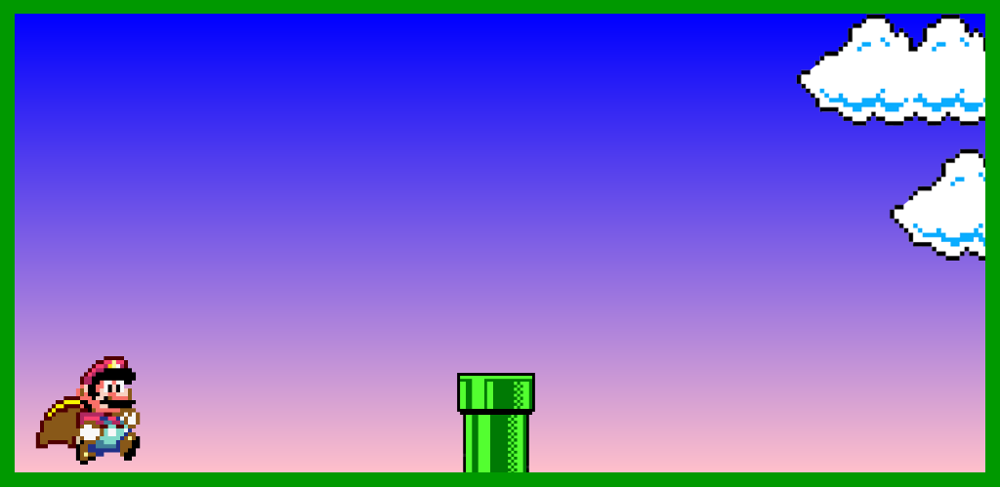
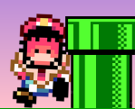

# JOGO DO ENCANADOR :video_game:

_Neste minigame, foi implementado um comando básico de pulo para o personagem, para entendermos como funciona a adição de uma ação para um personagem._

#### Através da função constante abaixo, podemos fazer a ação de pulo, do personagem.

#### Ainda co direito a ambiente modelado, com fundo, e movimentação de objetos

#### Contamos ainda com uma mudança do estado do personagem, quando ele atinge o obstáculo, causando assim o final do jogo.

