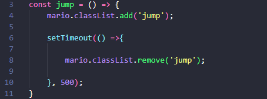

# JOGO DO ENCANADOR :video_game:

_Neste minigame, foi implementado um comando básico de pulo para o personagem, para entendermos como funciona a adição de uma ação para um personagem._

#### Através da função constante abaixo, podemos fazer a ação de pulo, do personagem.

